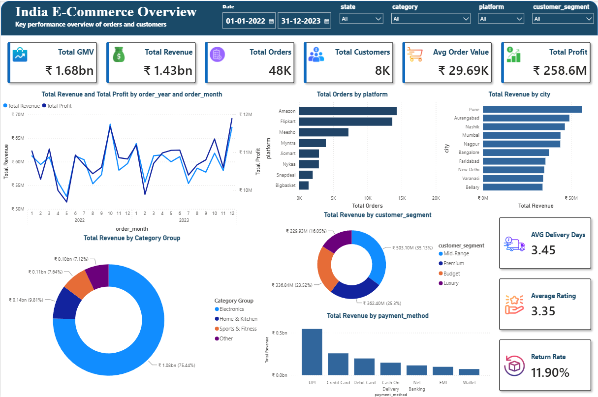

# 🛒 India E-Commerce Sales Analysis

> **End-to-end data analytics project** covering data engineering, SQL analysis, and Power BI dashboarding for a simulated Indian e-commerce business (2022–2023).

---

## 📊 Dashboard Preview

---

## 🧭 Project Overview

This project simulates a real-world analytics workflow for an Indian e-commerce business with operations across 9 platforms, multiple product categories, and customers spread across Indian states and cities.

The pipeline covers the full data journey:

1. **Raw CSV data** → cleaned and standardised with Python/pandas
2. **Cleaned data** → loaded into a MySQL relational database via SQLAlchemy
3. **Database** → queried with 10 business-focused SQL questions (including window functions and CTEs)
4. **Insights** → visualised in an interactive Power BI executive dashboard

---

## ⚡ Key Metrics (2022–2023)

| Metric | Value |
|---|---|
| Total GMV | ₹1.68 Billion |
| Total Revenue | ₹1.43 Billion |
| Total Orders | 48,000+ |
| Total Customers | 8,000+ |
| Average Order Value | ₹29,690 |
| Total Profit | ₹258.6 Million |
| Average Delivery Time | 3.45 days |
| Average Customer Rating | 3.35 / 5.0 |
| Return Rate | 11.90% |

---

## 🛠️ Tools & Technologies

| Layer | Technology |
|---|---|
| Data Cleaning | Python, pandas |
| Database | MySQL, SQLAlchemy |
| SQL Analysis | MySQL (DDL, DML, Window Functions, CTEs) |
| Visualisation | Microsoft Power BI |

---

## 🔧 Data Cleaning Highlights

The raw data had several quality issues that were resolved before loading to MySQL:

- **Mixed date formats** across `order_date` and `delivery_date` — fixed with `pd.to_datetime(format='mixed')`
- **Inconsistent categorical values** — platform names, payment methods, states, cities standardised with `.str.title()` and mapping dicts
- **`discount_pct` stored as strings** like `"6.7%"` — parsed with a custom function to extract float values
- **`revenue` with comma separators** — stripped and recast to numeric
- **`returned` flag in mixed types** — `'Yes'/'No'` and `0/1` unified to binary int
- **Gender encoding** — `'M'/'F'` normalised to `'Male'/'Female'`

---

## 🗄️ SQL Analysis — Business Questions

| # | Question | Technique |
|---|---|---|
| Q1 | Total orders per platform, ranked | `GROUP BY` + `ORDER BY` |
| Q2 | Orders with revenue > ₹1M and no return | `WHERE` filter |
| Q3 | Customer count by gender | `GROUP BY` |
| Q4 | Top 5 customers by revenue & profit | `INNER JOIN` + `GROUP BY` |
| Q5 | Top 5 states by total GMV | `GROUP BY` + `ORDER BY` |
| Q6 | Categories with avg margin ≤ 20% | `HAVING` clause |
| Q7 | Return rate % per category | Calculated aggregation |
| Q8 | Best-profit city per state | `DENSE_RANK()` window function + CTE |
| Q9 | Monthly revenue + running cumulative (2023) | `SUM() OVER()` window function |
| Q10 | Top-profit product per category | `ROW_NUMBER() OVER(PARTITION BY)` + CTE |

---

## 📈 Dashboard Features (Power BI)

The single-page interactive dashboard includes:

- **Slicers** — filter by date range, state, product category, platform, and customer segment
- **Revenue & Profit trend** — dual-axis line chart across 2022–2023 months
- **Orders by Platform** — horizontal bar chart ranking all 9 platforms
- **Revenue by City** — top 10 cities ranked by total revenue
- **Customer Segment breakdown** — donut chart (Mid-Range 35.1%, Budget 25.3%, Premium 23.5%, Luxury 16.1%)
- **Revenue by Payment Method** — UPI dominates India's digital payments
- **KPI Cards** — instant view of GMV, Revenue, Orders, Customers, AOV, Profit, Delivery Days, Rating, Return Rate

---

## 🔍 Key Findings

- **Amazon India** leads all platforms by order volume; Bigbasket has the lowest share
- **Electronics** accounts for ~75% of total revenue by category
- **Pune** is the single highest-revenue city; Maharashtra leads state-level GMV
- **Mid-Range** customer segment drives 35% of total revenue (₹503M)
- **UPI** is the #1 payment method, consistent with India's fintech adoption trends
- A **return rate of 11.9%** is concentrated in specific categories — a target for inventory and policy review
- Revenue shows a strong **year-end seasonal spike** in late 2023

---

## 📌 Skills Demonstrated

`Data Cleaning` `ETL Pipeline` `pandas` `MySQL` `SQLAlchemy` `Window Functions` `CTEs` `Power BI` `DAX` `Dashboard Design` `Business Intelligence` `Data Storytelling`

---

## 📄 License

This project uses a simulated dataset for educational purposes.

---

*Built as part of a data analytics portfolio to demonstrate end-to-end project delivery from raw data to business insights.*
